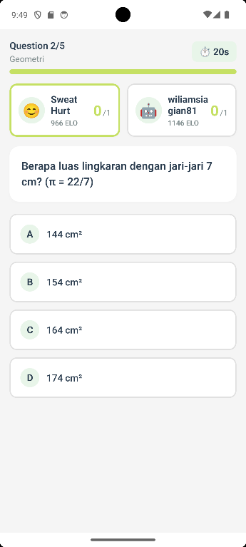

# LevelUp - Math Quiz App

Multiplayer math quiz application with timer and scoring system.




## Features

- ✅ Single player quiz mode
- ✅ 5 math questions (SMP level)
- ✅ 10-second timer per question
- ✅ Real-time score tracking
- ✅ Instant feedback (correct/wrong)
- ✅ Detailed results with stats
- ✅ Clean green theme UI
- ✅ Mobile-first design

## Tech Stack

- **React Native** (Expo)
- **TypeScript**
- **React Native Paper** (UI components)
- **Expo Linear Gradient**
- **React Native Reanimated**

## Getting Started

### Install Dependencies
```bash
npm install
```

### Run on Web
```bash
npm run web
```

### Run on Android
```bash
npm run android
```

### Run on iOS (Mac only)
```bash
npm run ios
```

## Project Structure

```
src/
  ├── screens/
  │   ├── HomeScreen.tsx      # Input username & start quiz
  │   ├── QuizScreen.tsx      # Main quiz with timer
  │   └── ResultsScreen.tsx   # Show results & stats
  ├── types/
  │   └── index.ts            # TypeScript interfaces
  ├── theme/
  │   └── colors.ts           # Green theme colors
  └── utils/
      └── questions.ts        # Hardcoded quiz questions
```

## How It Works

1. **Home**: User enters their name
2. **Quiz**: 5 questions appear one by one with 10s timer
3. **Results**: Shows total score, correct/wrong breakdown, and average time

## Color Theme

Based on the LevelUp logo green:
- Primary: `#C5E063` (Lime green)
- Primary Dark: `#5FAD56` (Forest green)
- Background: `#E8F5E9` (Mint)

## Next Steps (Multiplayer)

- [ ] Setup Supabase backend
- [ ] Room code system
- [ ] Real-time 2-player battle
- [ ] ELO rating system
- [ ] Friends & leaderboard

## License

MIT
