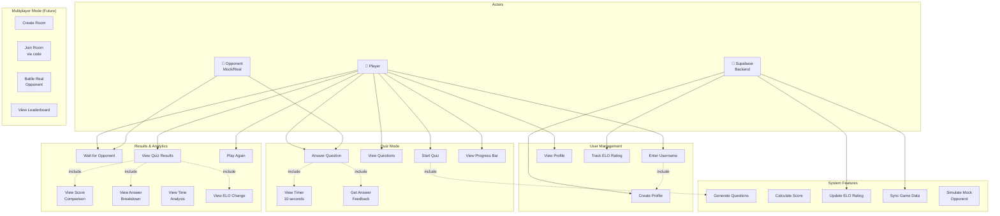

# LevelUp - Use Case Diagram

## Tentang Aplikasi
LevelUp adalah aplikasi **Math Battle Quiz** berbasis React Native yang memungkinkan pemain menguji kemampuan matematika mereka dalam mode kompetitif.

---

## Use Case Diagram



---

## Daftar Use Cases

### 👤 User Management

| Use Case | Deskripsi | Actor |
|----------|-----------|-------|
| **UC1: Enter Username** | Pemain memasukkan username untuk memulai | Player |
| **UC2: Create Profile** | Sistem membuat profil pemain di database | Backend |
| **UC3: View Profile** | Pemain melihat profil (username, avatar, ELO) | Player |
| **UC4: Track ELO Rating** | Sistem melacak rating ELO pemain | Backend |

### 📝 Quiz Mode

| Use Case | Deskripsi | Actor |
|----------|-----------|-------|
| **UC5: Start Quiz** | Pemain memulai quiz matematika (5 soal) | Player |
| **UC6: View Questions** | Pemain melihat soal matematika SMP | Player |
| **UC7: Answer Question** | Pemain memilih jawaban dari 4 pilihan | Player, Opponent |
| **UC8: View Timer** | Pemain melihat timer 10 detik per soal | System |
| **UC9: Get Answer Feedback** | Pemain mendapat feedback hijau/merah | System |
| **UC10: View Progress Bar** | Pemain melihat progress quiz (1-5 soal) | Player |

### 📊 Results & Analytics

| Use Case | Deskripsi | Actor |
|----------|-----------|-------|
| **UC11: Wait for Opponent** | Pemain menunggu opponent menyelesaikan quiz | Player, Opponent |
| **UC12: View Quiz Results** | Pemain melihat hasil akhir quiz | Player |
| **UC13: View Score Comparison** | Pemain melihat perbandingan skor vs opponent | Player |
| **UC14: View Answer Breakdown** | Pemain melihat detail jawaban per soal | Player |
| **UC15: View Time Analysis** | Pemain melihat waktu yang dihabiskan per soal | Player |
| **UC16: View ELO Change** | Pemain melihat perubahan ELO (+15/-12) | Player |
| **UC17: Play Again** | Pemain memulai quiz baru | Player |

### 🎮 Multiplayer Mode (Future)

| Use Case | Deskripsi | Status |
|----------|-----------|--------|
| **UC18: Create Room** | Pemain membuat room dengan kode 6 karakter | 🔄 UI Ready |
| **UC19: Join Room** | Pemain join room menggunakan kode | 🔄 UI Ready |
| **UC20: Battle Real Opponent** | Pemain bertanding dengan pemain lain secara real-time | 🔄 Planned |
| **UC21: View Leaderboard** | Pemain melihat ranking global/teman | 🔄 Planned |

### ⚙️ System Features

| Use Case | Deskripsi |
|----------|-----------|
| **SYS1: Generate Questions** | Sistem menghasilkan 5 soal matematika random |
| **SYS2: Calculate Score** | Sistem menghitung skor benar/salah |
| **SYS3: Update ELO Rating** | Sistem update ELO berdasarkan hasil (Win: +15, Loss: -12) |
| **SYS4: Sync Game Data** | Sistem sinkronisasi data ke Supabase |
| **SYS5: Simulate Mock Opponent** | Sistem simulasi opponent AI (70% success rate) |

---

## Actors

### 1. 👤 Player (Primary Actor)
- **Deskripsi**: Pengguna utama yang memainkan quiz matematika
- **Tujuan**:
  - Menguji kemampuan matematika
  - Meningkatkan ELO rating
  - Bersaing dengan pemain lain

### 2. 👤 Opponent (Secondary Actor)
- **Deskripsi**: Lawan bermain (mock AI atau pemain real)
- **Tipe**:
  - **Mock Opponent**: AI dengan success rate 70% (mode saat ini)
  - **Real Opponent**: Pemain lain (future feature)

### 3. 💾 Supabase Backend (System Actor)
- **Deskripsi**: Database dan backend system
- **Fungsi**:
  - Menyimpan data users, rooms, game sessions
  - Mengelola ELO rating
  - Sinkronisasi data real-time

---

## User Journey Flow

```
┌─────────────┐
│ Home Screen │
│ Enter Name  │
└──────┬──────┘
       │
       ▼
┌─────────────┐
│ Quiz Screen │
│ 5 Questions │ ◄─── 10 seconds timer per question
│ 4 Options   │
└──────┬──────┘
       │
       ▼
┌──────────────┐
│ Waiting For  │
│ Opponent     │
└──────┬───────┘
       │
       ▼
┌──────────────┐
│ Results Page │
│ - Score      │
│ - ELO Change │
│ - Breakdown  │
└──────┬───────┘
       │
       ▼
┌──────────────┐
│ Play Again?  │
└──────────────┘
```

---

## Relasi Use Case

### Include (<<include>>)
- **UC1 → UC2**: Enter Username otomatis membuat profile
- **UC5 → SYS1**: Start Quiz otomatis generate questions
- **UC7 → UC8**: Answer Question include timer countdown
- **UC7 → UC9**: Answer Question include feedback
- **UC12 → UC13/UC14/UC16**: Results include score comparison, breakdown, ELO

### Extend (<<extend>>)
- **SYS5 → UC11**: Mock opponent extends waiting screen
- **SYS3/SYS4 → UC12**: ELO update dan sync data extend results
- **UC18/UC19 → UC20**: Create/Join room extend battle mode

---

## Topik Matematika Quiz

| No | Topik | Contoh Soal | Tingkat |
|----|-------|-------------|---------|
| 1 | Perkalian | 15 × 8 = ? | SMP |
| 2 | Aljabar | x + 12 = 27, x = ? | SMP |
| 3 | Geometri | Luas persegi 9 cm × 9 cm = ? | SMP |
| 4 | Pembagian | 144 ÷ 12 = ? | SMP |
| 5 | Persentase | 25% dari 80 = ? | SMP |

---

## ELO Rating System

| Hasil | Perubahan ELO |
|-------|---------------|
| 🏆 Win | **+15** |
| 💀 Loss | **-12** |
| 🤝 Draw | **0** |

---

## Teknologi Stack

- **Frontend**: React Native + Expo
- **Language**: TypeScript
- **UI Library**: React Native Paper
- **Backend**: Supabase (PostgreSQL)
- **Storage**: AsyncStorage (local session)
- **Animation**: Reanimated

---

## Cara Melihat Diagram PlantUML

### Online (Recommended)
1. Buka file `usecase-diagram.puml`
2. Copy isi file
3. Paste ke [PlantUML Online Editor](http://www.plantuml.com/plantuml/uml/)
4. Lihat diagram yang ter-generate

### VS Code
1. Install extension "PlantUML"
2. Buka file `usecase-diagram.puml`
3. Press `Alt+D` untuk preview

### Command Line
```bash
# Install PlantUML
npm install -g node-plantuml

# Generate PNG
puml generate usecase-diagram.puml -o usecase-diagram.png
```

---

## Status Implementasi

| Feature | Status |
|---------|--------|
| ✅ Single Player Quiz | **Implemented** |
| ✅ Timer & Scoring | **Implemented** |
| ✅ Results Dashboard | **Implemented** |
| ✅ Mock Opponent | **Implemented** |
| ✅ Supabase Integration | **Implemented** |
| 🔄 Room Creation | **UI Ready** |
| 🔄 Room Joining | **UI Ready** |
| ⏳ Real Multiplayer | **Planned** |
| ⏳ Leaderboard | **Planned** |

---

**Dibuat oleh**: Claude
**Tanggal**: 17 November 2025
**Versi Aplikasi**: Phase 1 (Single Player) + Multiplayer UI
